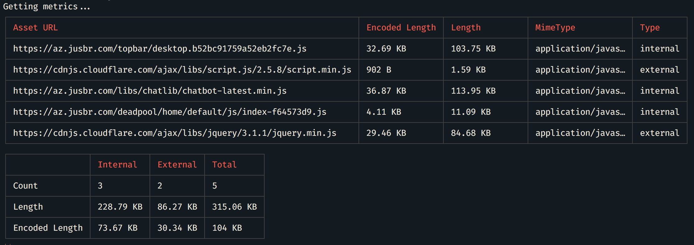
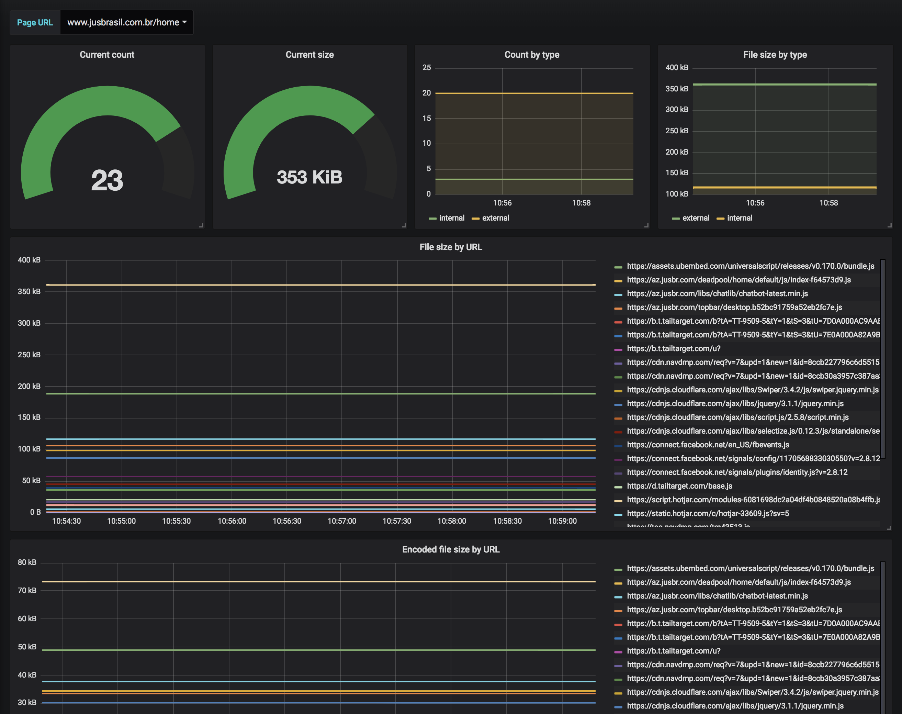

# Puppeteer Assets [](https://badge.fury.io/js/puppeteer-assets) [](https://travis-ci.org/andersonba/puppeteer-assets)
> Gets assets metrics using [Puppeteer](https://github.com/googlechrome/puppeteer).

Want to know which scripts are loaded in your page? This module allows you to extract and audit the metrics.



## Set up
```bash
yarn add puppeteer-assets
```

## Usage
Using CLI
```bash
puppeteer-assets www.google.com
```

Using on Node.js
```javascript
const assetsMetrics = require('puppeteer-assets');

const metrics = await assetsMetrics('https://www.google.com');
```

## Prometheus

Exports assets metrics via HTTP for Prometheus consumption.



Use [docker image](https://hub.docker.com/r/andersonba/prometheus-assets/):
```bash
docker run --name=prometheus-assets -e ASSETS_PAGE_URL=www.google.com -d -p 3000:3000 andersonba/prometheus-assets
```

Now, add the target in your `prometheus.yaml`.
You can monitor multiple URLs passing `params` each scrape config. [See example](prometheus/prometheus.yml#L12-L33)

#### Environment variables
- `ASSETS_PAGE_URL`
- `ASSETS_INTERNAL_REGEX`

## Reference

#### `assetsMetrics(url, options)`
Execute the command

##### Parameters
* `url` - **Required.** Page URL.
* `options.internalRegex` - String/Regex. Identify scripts as Internal based on RegExp *(Default: null)*
* `options.mimeTypes` - Array of String/RegExp. File types to be matched *(Default: 'javascript')*
