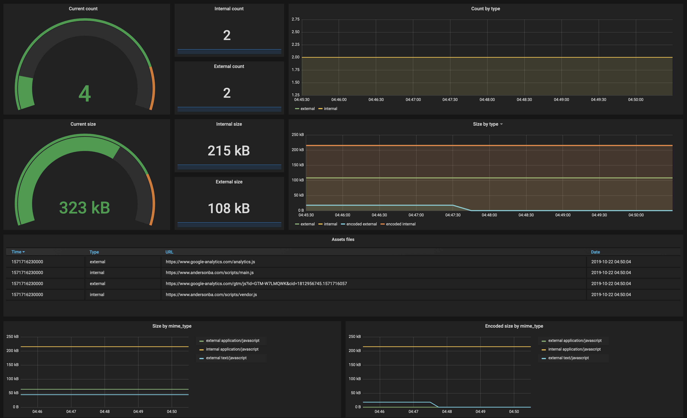

# Puppeteer Assets [](https://badge.fury.io/js/puppeteer-assets) [](https://travis-ci.org/andersonba/puppeteer-assets)

> Measuring your assets with metrics using [Puppeteer](https://github.com/googlechrome/puppeteer).

Want to know which scripts are loaded in your page? This module allows you to extract and audit the metrics.


## Install

```bash
yarn add puppeteer-assets
```

## Usage

Using CLI

```bash
puppeteer-assets www.google.com
```

Advanced usage:

```bash
puppeteer-assets www.google.com -t javascript -t css --ignore gooogle-analytics
```

Run `puppeteer-assets --help` to more options.

Using on Node.js

```javascript
import assetsMetrics from 'puppeteer-assets';

await assetsMetrics('https://www.andersonba.com');
{
  assets: {
    'https://www.andersonba.com/scripts/main.js': {
      mimeType: 'javascript',
      rawMimeType: 'application/javascript',
      type: 'internal',
      gzip: 1621,
      size: 1621
    },
    'https://www.andersonba.com/scripts/vendor.js': {
      mimeType: 'javascript',
      rawMimeType: 'application/javascript',
      type: 'internal',
      gzip: 213438,
      size: 213438
    },
    'https://www.google-analytics.com/analytics.js': {
      mimeType: 'javascript',
      rawMimeType: 'text/javascript',
      type: 'external',
      gzip: 0,
      size: 44470
    }
  },
  count: {
    internal: { total: 2, javascript: 2 },
    external: { total: 1, javascript: 1 },
    total: 3
  },
  size: {
    internal: { total: 215059, javascript: 215059 },
    external: { total: 44470, javascript: 44470 },
    total: 259529
  },
  gzip: {
    internal: { total: 215059, javascript: 215059 },
    external: { total: 0, javascript: 0 },
    total: 215059
  }
}
```

## Prometheus

Explore and monitor your assets metrics using [Prometheus](https://prometheus.io) and [Grafana](https://grafana.com).



You need to configure a webservice to be the Prometheus target.

You can use the [official built-in server](./prometheus/README.md).

## Reference API

#### `assetsMetrics(url, options)`

| Parameter | Description | Type | Default |
|-----------|-------------|------|---------|
| `url` | **Required.** Page URL | `string`
| `options.mimeTypes` |  MimeTypes to be filtered in the metrics. You can use mapped mimeTypes from `options.mimeTypePatterns` | `Array<RegExp \| string> ` | `['javascript']`
| `options.mimeTypePatterns` | Map the mimeTypes based on regex patterns | `Array<RegExp \| string>` | `{ javascript: ['javascript'], css: ['css'] }`
| `options.ignorePatterns` | Ignore assets based on regex patterns | `Array<RegExp \| string>` | `[]`
| `options.internalPatterns` | Mark asset as internal type based on regex patterns | `Array<RegExp \| string>` | `[/^(\/\|.\/)/]`
